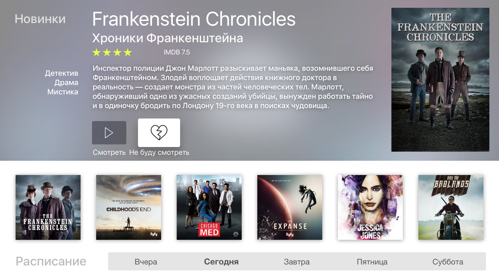

# Soap4TV

Клиент Apple TV для Soap4me

[https://www.youtube.com/watch?v=so89pi8tDS0](https://www.youtube.com/watch?v=so89pi8tDS0)

### Описание

Простой клиент soap4.me для Apple TV. Написано на Swift 2.
Позволяет смотреть сериалы, при наличии платного аккаунта.

Самая первая попытка что-то в таком роде сделать, поэтому не совсем все чисто сделано. Тем, кому интересно поучаствовать - отправляйте свои PR. 

По всем вопросам - на мейл: peter@staticdreams.com
Или присоединяемся к нам в Slack: [appletv4.slack.com](appletv4.slack.com)

### Инструкции

1. Клонируем репозиторий
2. git checkout develop
3. Открываем Soa4TV.xcworkspace

Работаем и отправляем PR только в ветку develop. Master - только для мини релизов.

### License

Поставляется как есть, без всяких там гарантийных обслуживаний :-)

See the LICENSE file for license rights and limitations (MIT).